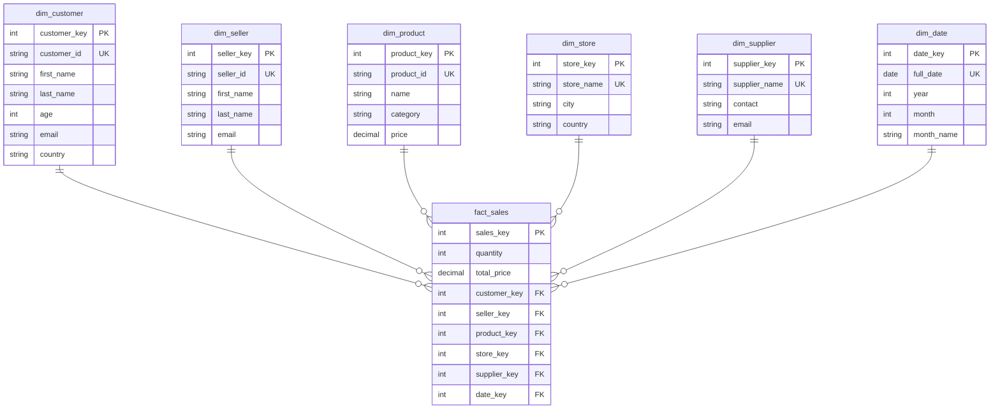

# Отчёт по лабораторной работе №1

**Тема:** Нормализация данных в модель «Снежинка»

## 1. Подготовка, данные и анализ

- Через **Docker** запущен **PostgreSQL**, для работы с SQL использовала **DBeaver**.
- В БД загружены 10 CSV-файлов (`mock_data(*).csv`) — всего **10 000 строк**.
- Исходная таблица (`mock_data_raw`) содержит данные о покупателях, продавцах, товарах, магазинах, поставщиках и продажах.

## 2. Что сделано

### 2.1. Созданы таблицы (DDL)
Файл `table_1.sql`:
- удаляет старые таблицы
- создаёт измерения: `dim_customer`, `dim_seller`, `dim_product`, `dim_store`, `dim_supplier`, `dim_date`
- создаёт таблицу фактов `fact_sales` со связями (внешними ключами)

### 2.2. Заполнены таблицы (DML)
Файл `table_2.sql`:
- в измерения добавлены уникальные значения из `mock_data_raw`
- факты заполнены через JOIN, чтобы связать все ключи

### 2.3. Проверка (валидация)
Файл `cleck.sql`:
- количество записей в фактах = **10 000** (совпадает с исходными данными)
- суммы продаж совпадают

## 3. Схема базы данных

## 4. Результат

Исходные данные успешно преобразованы в нормализованную модель «Снежинка».  