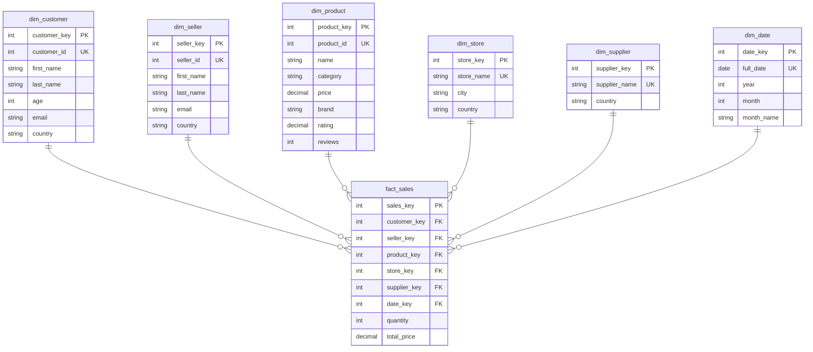

# Отчёт по лабораторной работе №2

**Тема:** ETL реализованный с помощью Spark

---

## 1. Подготовка, данные и анализ

- Запущены контейнеры Docker: **PostgreSQL**, **ClickHouse**, **Spark (Jupyter Notebook)**.
- Настроена сеть между контейнерами для взаимодействия, установлены JDBC-драйверы для подключения Spark к PostgreSQL и ClickHouse.
- В PostgreSQL загружены 10 CSV-файлов (`mock_data(*).csv`) — всего **10 000 строк**.
- Данные содержат информацию о продажах, покупателях, продавцах, товарах, магазинах и поставщиках.

---

## 2. Трансформация данных в модель «Снежинка» (Spark ETL)

С помощью **PySpark** реализован ETL-пайплайн:

- **Таблицы измерений:**
  - `dim_customer` – покупатели
  - `dim_seller` – продавцы
  - `dim_product` – товары (добавлены рейтинг и отзывы)
  - `dim_store` – магазины
  - `dim_supplier` – поставщики
  - `dim_date` – календарь дат

- **Таблица фактов:**
  - `fact_sales` – записи о продажах (связывает все измерения)

- Данные загружены в **PostgreSQL**.

---

## 3. Создание отчётов в ClickHouse

На основе модели «Снежинка» сформированы отчёты в ClickHouse:

| № | Отчёт | Таблица в ClickHouse |
|---|-------|----------------------|
| 1 | Топ-10 самых продаваемых продуктов | `report_products` |
| 2 | Топ-10 клиентов по сумме покупок | `report_customers` |
| 3 | Продажи по месяцам | `report_time` |
| 4 | Топ-5 магазинов с наибольшей выручкой | `report_stores` |
| 5 | Топ-5 поставщиков с наибольшей выручкой | `report_suppliers` |
| 6 | Качество продуктов | `report_quality` |

---

## 4. Результаты

- Все таблицы измерений и фактов заполнены (`fact_sales` содержит **10 000 записей**).
- Созданы отчёты в ClickHouse.

---

## 5. Схема базы данных



---

## 5. Инструкция по запуску

**Запуск контейнеров:**
```bash
cd lab2
docker-compose up -d
```
